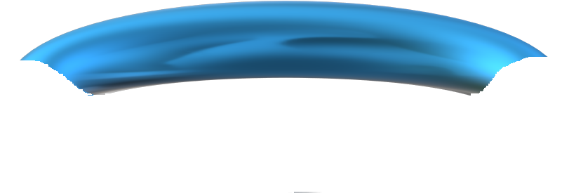

<div align="center">
  
</div>

[Boopball](https://alexrobincrabbe.github.io/Boopball/) Is a . 

## Table of Contents
1. <details open>
    <summary><a href="#ux">UX</a></summary>

    <ul>
    <li><details>
    <summary><a href="#goals">Goals</a></summary>

    - [Visitor Goals](#visitor-goals)
    - [Business Goals](#business-goals)
    - [User Stories](#user-stories)
    </details></li>

    <li><details>
    <summary><a href="#visual-design">Visual Design</a></summary>

    - [Wireframes](#wireframes)
    - [Fonts](#fonts)
    - [Icons](#icons)
    - [Colors](#colors)
    </li>
    </ul>
    </details>
</details>

2.  <details open>
    <summary><a href="#features">Features</a></summary>
    <ul>

    <li><details>
    <summary><a href="#page-elements">Page Elements</a></summary>

    - [Header](#header)
    - [Introduction](#introduction)
    - [Controls](#controls)
    </li>
    
    <li><details>
    <summary><a href="#game-window">Game Window</a></summary>

    - [Main Window](#main-window)
    - [Alert Windows](#alert-windows)
    - [Settings Window](#settings-window)
    </ul>

3. <details open>
    <summary><a href="#technologies-used">Technologies Used</a></summary>

    - [Languages](#languages)
    - [Libraries](#libraries)
    - [Platforms](#platforms)
    - [Other Tools](#other-tools)
</details>

4. <details open>
    <summary><a href="#testing">Testing</a></summary>

    <ul>
    <li><details>
    <summary><a href="#methods">Methods</a></summary>

    - [Validation](#validation)
    - [General Testing](#general-testing)
    - [Mobile Testing](#mobile-testing)
    - [Desktop Testing](#desktop-testing)
    </details></li>
    <li><details>
    <summary><a href="#bugs">Bugs</a></summary>

    - [Unfixed Bugs](#unfixed-bugs)
    - [Fixed Bugs](#fixed-bugs)
    </details></li>
    </li>
    </ul>
</details>

5. <details>
    <summary><a href="#deployment">Deployment</a></summary>

    - [Clone Repository](#local-preparation)
    - [Deploy from Github](#local-instructions)
    
</details>

6. <details>
    <summary><a href="#credits">Credits</a></summary>

    - [Images](#images)
    - [Code](#code)
    - [Tests](#tests)
    - [Readme](#readme)
</details>

----

# UX
## Goals
### Visitor Goals
The target audience for Boopball are:
- People who want to play a fun and colourful game

User goals are:
- Have fun
- Try the game on different difficulty settings for replayability
- Be able to play for as long as I want, and pause the game if necessary

Boopball fills these needs by:
- Providing a simple easy to understand game interface that allows the user to play the game with a short learning curve
- Allowing the user to select different time limits to adjust the difficulty if the game is too hard, and to try different difficulties after they have completed the game
- Providing 5 different levels with different challenges to engage the player
- Displaying colourful and fun graphics
- Allowing the option to add sound effects to enhance the game experience

### Business Goals
The Business Goals of Boopball are:
- Provide a fun game to engage visitors to the website
- Showcase the skills of the website owner


### User Stories
1. As a user looking to fill in some empty time, I expect to be quickly understand and be engaged in the game.
2. I expect a game that is moderately challenging and to be able to adjust the difficulty if the game is too hard or too easy.
3. I expect the game instructions to be immediately visible and easy to understand
4. I expect the game controls to be clear and easy to understand
5. I expect to be able to choose to turn sounds and background music on, according to my own preferences

## Visual Design
### Wireframes

Wireframes were made with pencil and paper.


### Fonts
<div align="left">

</div>
<div align="left">

</div>
<div align="left">

</div>

<br>

- The primary font [monoton](https://fonts.google.com/specimen/Monoton) was chosen for its immediate visual impact and retro style feel. It was used for the header and headings.

- The secondary font [merienda](https://fonts.google.com/specimen/Merienda) was chosen for the game instructions. It is easy to read, but is still somewhat stylised.

- The tertiary font [rock salt](https://fonts.google.com/specimen/Merienda) was used for the in game text. It has a cartoony look, which goes with the game graphics style.

### Icons

#### Favicon

<div align="center">
  
</div>

- The Favicon was made by taking a screenshot of the site logo, converting it with an [ICO converter](https://cloudconvert.com/png-to-ico), then removing the background with MS Paint.

### Colors
<div align="center">
  
</div>

- The primary colour used for the site is RGB(184, 109, 44)(#B86D2C) a dark orange. It was chosen for it's warm colourful feel.
- Darker purple/pinks - RGB(83,48,72)(#533048)/RGB(127,59,59)(#7F3B3B) were chosen to contrast the text.
- RGB(237, 206, 70)(#EDCE46) was chosen for the text, to give a good contrast with the background, and compliment the orange theme. 
- RGB(40,106,148)(#286A94) was chosen for the in-game buttons, to compliment the game graphic colours. The colour was darkened a little to give a better text contrast.

### Game graphics

#### Background image

<div align="left">
  
</div>

I drew the background image using MS paint, then used [pixlr](https://pixlr.com/express/) to add a liquifying effect, and finally blurred the image to make the foreground stand out.

#### Booper

<div align="left">
  
</div>

I made  the booper image entirely using MS paint.

#### Ball and hoop

<div align="left">
  
  
  
</div>


These were made with MS paint 3D. The hoop was cut into two images using MS paint to give the effect of the ball passing through the hoop. 

# Sounds

## Background music

## Sound Effects

# Features

## Page Elements

### Header

<div align="center">
  
</div>
<div align="center">
  
</div>

- As the site is only one page, the header just contains the site logo
- The header stays at the top of the screen when scrolled
- Once the document has loaded, the two lines expand out from the logo at either side (just because it looks cool)

### Introduction

<div align="center">
  

</div>

The introduction contains information about the rules of the game, summarized in bullet points.

### Controls

<div align="center">
  

</div>

This section explains the controls for the game, for both desktop and mobiel.

## Game Window

### Main Window

<div align="center">
  
</div>

The game window size is optimized for mobile screens. On larger screens is is positioned at the center, with the text boxes on either side to fill the screen space. All of the game controls take place on this part of the screen, except for the pause function, which can be triggered on desktop using the escape key at any time.

### Alert Windows

<div align="center">
  
</div>

These contain messages and control buttons, to either continue, quit, or go to the settings. They are triggered at the start of the game, when the game is paused, when the game is over, or when a level is completed. There is only one alert window HTML element, and the content is manipulated with javascript.

### Settings Window

<div align="center">
  
</div>

In the settings window, the user can choose to turn on game sound effects, and background music (which are disables by default). The user can also change the game difficulty by selecting a different time limit for each level.

# Technologies Used
## Languages
- HTML
    * Page markup
- CSS
    * Styling
- Javascript
    * Game mechanics
    * Manipulating DOM content

## Libraries
- [Google Fonts](https://fonts.google.com)
    * Font Styles

## Platforms
- [Github](https://github.com/)
    * Storing code remotely and deployment.
- [Gitpod](https://gitpod.io/)
    * IDE for project development.

## Other Tools
### Sound editing
- [Audiotrimmer](https://audiotrimmer.com/#)
    * Trim sound effects clips
- [mp3cut](https://mp3cut.net/change-volume)
    * Adjust sound volumes
- [noisereducer](https://noisereducer.media.io/speech-enhancement/)
    * Remove background noise from sound clips
### Image editing
- [MSpaint](https://www.microsoft.com/en-us/windows/paint)
    * Draw game graphics
- [MSpaint3D](https://apps.microsoft.com/detail/9nblggh5fv99?hl=de-de&gl=DE)
    * Draw game graphics
- [pixlr](https://pixlr.com/express/)
    * Add liquify and blur effect to game window background image
- [cloudconvert](https://cloudconvert.com/png-to-ico)
    * Convert favicon image from .png to .ico format

----

# Testing
## Methods
### Validation

#### HTML

- HTML has been validated with [W3C HTML5 Validator](https://validator.w3.org/).

<div align="center">
  
  
  
</div>

#### CSS

- CSS has been validated with [W3C CSS Validator](https://jigsaw.w3.org/css-validator/) 

<div align="center">
    
</div>

#### Lighthouse

- Home Page (Desktop)

<div align="center">
    
</div>

- Home Page (Mobile)

<div align="center">
    
</div>

- Gallery Page (Desktop)

<div align="center">
    
</div>

- Gallery Page (Mobile)

<div align="center">
    
</div>

- Contact Page (Desktop)

<div align="center">
   
</div>

- Contact Page (Mobile)

<div align="center">
    
</div>

#### Mobile Testing

- I tested the site on my android device. All pages and links worked correctly.

- On iOS the submit button on the contact page seems to have a minor issue:

<div align="center">
    
</div>

#### Desktop Testing

- I checked all pages and links on Chrome, Safari, Microsoft Edge, and Mozilla Firefox.

- No problems were found on Chrome, Safari, or Microsoft Edge.

- A problem was found on the gallery page in Mozilla Firefox (see [unfixed bugs](#unfixed-bugs)).

## Bugs

### Unfixed Bugs

- In Mozzilla Firefox, a bug was found on the gallery page. There is a large spacing between
gallery images. 

<div align="center">
    
</div>

- The source of the bug was determined to be the sizing of the image-container class divs.

 - I checked the size of the gallery container, which contain the divs, and the images and labels inside the divs to see if any of these were the causing the image containers to be resized, but all other elements had the correct sizing. 

- Shown below are the dimensions of the image containers.

<div align="center">
    
</div>

- The only way I could get the container width to change was by setting a fixed width, however since the images are different sizes, this was not a solution to the bug. 

- The sizing works correctly on all other browsers (Chrome, Edge, Safari).

### Fixed Bugs

- A bug was found: The image labels in the gallery showed in front of the header when scrolling.

<div align="center">
    
</div>

- The bug was fixed by changing the z-index of the image labels to be lower than the z-index of the header.

# Deployment

## Clone the Repository

1. Open a terminal in the folder you want to clone the project to.

2. In the terminal type:

    ```
      git clone https://github.com/alexrobincrabbe/build_a_treehouse
    ```

3. Change to the repository folder:

    ```
      cd .\build_a_treehouse\
    ```

6. Remove the origin:

    ```
      git remote rm origin"
    ```

5. On Github, create a new repository with a name of your choosing.

6. Add your Github repository to the origin:

    ```
      git remote add origin <url of your repository>
    ```

7. Push the files to your repository:

    ```
      git push --set-upstream origin main
    ```

## Deploy from Github

1. On Github, open the repository you made.

2. Open "settings" tab.

3. Click on "pages".

4. Under branch, select branch "main".

5. Click save.

6. Wait a few minutes, refresh the page.

7. The link to the deployed site will appear near the top of the page.

# Credits

## Images

All images on the site are photos taken by myself of a treehouse I built, with the exception of the Mini-Gallery images (which only features in the desktop version).

Image sources:

https://cdn.apartmenttherapy.info/image/upload/v1558432909/at/archive/5ba159856722b52e4c3be0545e70c1a37282623e.jpg

https://www.familyhandyman.com/wp-content/uploads/2019/05/FH12MAR_52_651_005-treehouse-building-tips-1.jpg

https://i.pinimg.com/736x/f5/ec/3b/f5ec3b5c87e410f437f42002f82ee563.jpg

https://www.pinterest.de/pin/548946642072268690/

https://d3emaq2p21aram.cloudfront.net/media/cache/venue_roundup_single_image/uploads/%200Regular_Roundup/Treehouse2017/Cindercone_05.jpg

## Code

The [Love Running](https://github.com/Code-Institute-Solutions/love-running-v3) project was used as a template for the header and footer in the html code.

## Tests

Thanks to Lewis for checking my site on his iPhone, and Ioan for helping me optimize the images.

## Readme

The [readme](https://github.com/Ri-Dearg/horizon-photo/blob/master/README.md?plain=1) by Rory Patrick (mentor) was used as a template. 